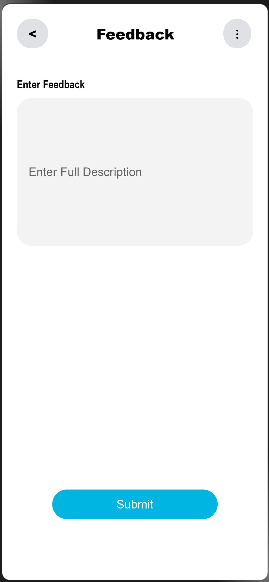

# MaterialUICustomerComplaint
Allow user to create Complaints in OpenHarmony.


 **-->  Screen1**
 


 **-->  Screen3**
 



## Usage Instructions

1. Code for creating Complaint Categories with the help of **Material Select**:
```
MaterialSelect({
  menu: [
    new MenuOption('Category_1', 1),
    new MenuOption('Category_2', 2),
    new MenuOption('Category_3', 3),
    new MenuOption('Others', 4)
 ],          
 onSelect: (it: MenuOption) => {
  this.Complaint_type = it.getValue()
  },
    model: this.selectModel,
    menuModel: this.selectMenuModel,
})
```

2. Code for taking input as **Description of Complaint** with the help of Placeholder:

```
TextInput({ placeholder: this.PlaceHolder_Text, text: this.Input_Text })
  .width('100%')
  .height('200vp')
  .fontFamily('cursive')
  .onChange((value: string) => {
      this.Input_Text = value
 })
 ```
 
 3. Code for **creating card** of the given Complaint: 

```
private current = new Date();
private subHead: CardModel = new CardModel(this.Complaint_type, 'Created on ' + this.current.toString())

private onButtonClick(button: button.Model) {
    router.push({ uri: "pages/Screen3"
    })
  }

private SubHead(model: CardModel) {
    model.setShowDivider(true)
    model.setCardType(CardType.Outlined)
    model.setCardBorderWidth("3vp")
    model.setLeadingIcon($r('app.media.icon'))
    model.setSupportingText("Description\n" + this.Input_Text)
    model.setCardHeight("250vp")
    model.setCardWidth("320vp")
    model.setCardBackGroundColor('#ffece5e5')
    model.setLeadingIconHeight("64vp")
    model.setLeadingIconWidth("64vp")
    model.setActions([new button.Model('Chat with Us', false, Color.White, 0x00B5E2, 15, ButtonType.Capsule, 30, 130),
    new button.Model('Resolved', false, Color.White, 0x00B5E2, 15, ButtonType.Capsule, 30, 110)])
    model.setButtonClick(this.onButtonClick)
    model.setActionClick(this.onButtonClick)
  }
  
  ```
  
### Use Cases

1. Select **Complaint Type** and input the **Description of the Complaint**.

2. Press **Submit** button to move to Screen2 and here card of the complaint will be shown that has been submitted.

3. Use **Resolved** button on any card to move to Screen3 and there you can submit its feedback and make this complaint resolved.
  

## Directory Structure
```
|---- MaterialUICustomerComplaint (Project Name)
|     |---- entry
|           |---- src
|                 |---- main
|                       |---- ets
|                             |----pages
|                                   |---- Screen1.ets
|                                   |---- Screen2.ets
|                                   |---- Screen3.ets

```


## Compatibility
Supports OpenHarmony API version 8 or above.


## Code Contribution

If you find any problems during usage, you can submit
an [Issue](https://github.com/Applib-OpenHarmony/MaterialUICustomerComplaint/issues) to us. Of course, we also welcome you to
send us [PR](https://github.com/Applib-OpenHarmony/MaterialUICustomerComplaint/pulls).

## Open source License

This project is based
on [Apache License 2.0](https://github.com/Applib-OpenHarmony/MaterialUICustomerComplaint/blob/main/LICENSE), please enjoy and
participate in open source freely.
